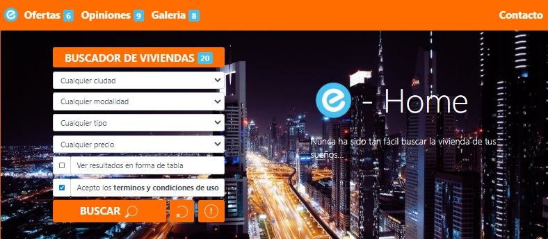
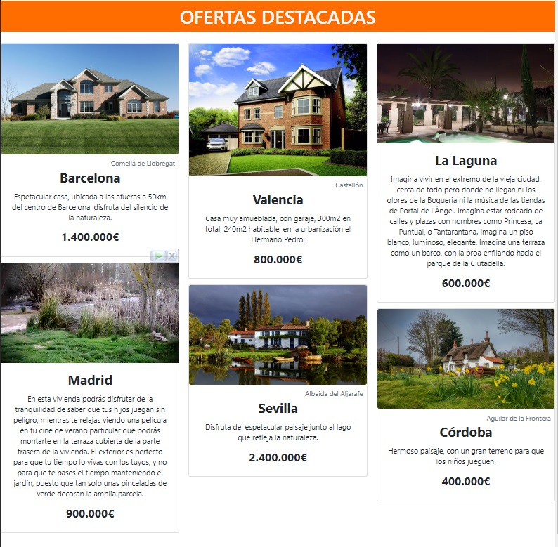

# **E-Home**

Web Application that simulates being the portal of a real estate 🏬 called **E-Home**.

## **Table of contents**

- [**E-Home**](#e-home)
  - [**Table of contents**](#table-of-contents)
  - [**General info**](#general-info)
  - [**Demo**](#demo)
  - [**Screenshots**](#screenshots)
  - [**Screenshots**](#screenshots-1)
  - [**Technologies**](#technologies)
  - [**Setup**](#setup)
  - [**Usage**](#usage)
  - [**Status**](#status)
  - [**Contact**](#contact)

## **General info**

**Date**: December, 2019.  
**Duration**: 1 Week.

This project was created in order to use the vast majority of **Bootstrap 4** components, for this reason it is overloaded with them 🤪. To have a certain functionality, a little of **JS** and **JQuery** have been added along with a list of 20 fictional houses to be able to use the filters. Additionally, the rest of the information on the page is fictitious.

## **Demo**

You can try it using the [Demo](https://udsgit.github.io/e-home)

> <br><i>Demo</i>

## **Screenshots**

> 
> <br><i>Search Engine and Featured</i>

## **Screenshots**


## **Technologies**

- **Html**
- **Css**
- **JavaScript**
- [**JQuery**](https://jquery.com/)
- [**Bootstrap 4**](https://getbootstrap.com/docs/4.1)

## **Setup**

It has no installation, you just need to clone or download the repository.

```console
git clone https://github.com/udsgit/e-home.git
```

## **Usage**

1. Open the link from the [Demo](https://udsgit.github.io/e-home) or open the file **index.html** if you downloaded it.
2. Now you can interact with the web, everything is interactive including the form.

## **Status**

Project is: **_Completed._**

Because the functionality was to practice with **Bootstrap 4** and its components.

## **Contact**

Created by [@Emmanuel](https://www.linkedin.com/in/emagleza/), feel free to contact me!
